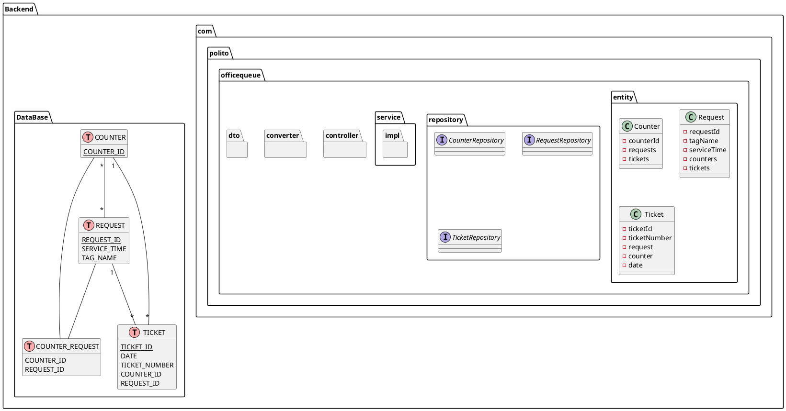

# Design Document 

# Low level design

```plantuml
@startuml
package "Backend" {
   package "com.polito.officequeue"{
      package "entity"{
         class "Counter"{
            - counterId 
            -  requests
            -  tickets
         }
         class "Request"{
            - requestId
            - tagName
            - serviceTime 
            - counters
            - tickets
         }
         class "Ticket"{
            - ticketId
            - ticketNumber
            - request
            - counter
            - date
         }

      }

      package "controller"{

      }
      package "controller"{

      }
      package "converter"{

      }
      package "dto"{

      }
      package "entity"{

      }
      package "repository"{
         interface CounterRepository{

         }
         interface RequestRepository{

         }
         interface TicketRepository{

         }

      }
      package "service"{

      }
      package "service.impl"{

      }
   }
   package DataBase{
   !define table(x) class x << (T,#FFAAAA) >>
   !define primary_key(x) <u>x</u>
   hide methods
   hide stereotypes

   table(COUNTER) {
      primary_key(COUNTER_ID)
   }
   table(COUNTER_REQUEST) {
      COUNTER_ID
      REQUEST_ID
   }
   table(REQUEST) {
      primary_key(REQUEST_ID)
      SERVICE_TIME
      TAG_NAME
   }
   table(TICKET) {
      primary_key(TICKET_ID)
      DATE
      TICKET_NUMBER
      COUNTER_ID
      REQUEST_ID
   }
   COUNTER -- COUNTER_REQUEST
   REQUEST -- COUNTER_REQUEST
   COUNTER "*"--"*" REQUEST
   COUNTER "1"--"*" TICKET
   REQUEST "1"--"*" TICKET
}
}


@enduml
```

